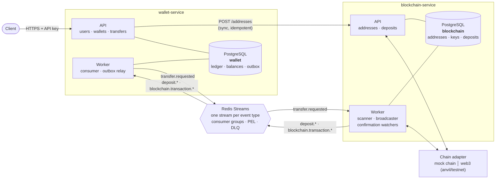
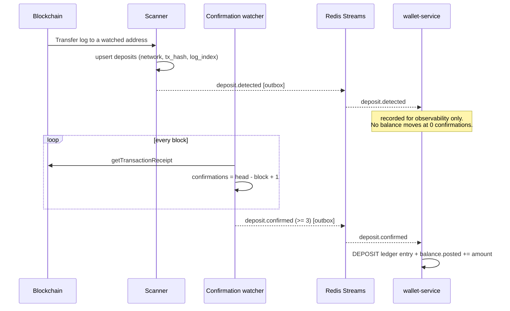
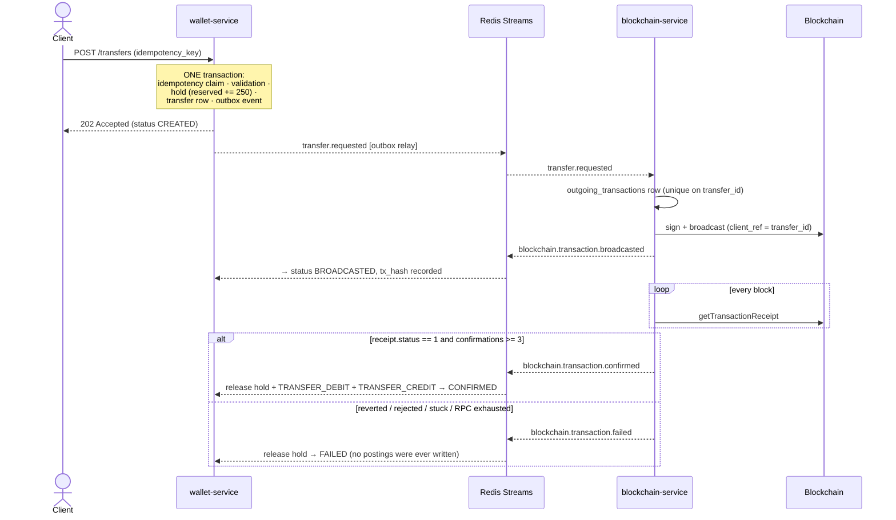

# Mini Crypto Wallet Platform

A two-service custodial wallet platform: users, wallets, a double-entry style
ledger, and USDT deposits and transfers settled on a blockchain.

The case scenario runs end to end:

```
User A deposits 1.000 USDT  ->  A: 1000.000000
User A sends 250 USDT to B  ->  A:  750.000000   B: 250.000000
```

`make demo` executes exactly that against a running stack and asserts the result.

**Status:** 106 tests (53 unit, 53 integration), all passing locally and inside
`docker compose`. The full flow -- including reorgs, RPC outages, reverted
transactions and stuck transactions -- is exercised by the suite.

---

## Table of contents

- [Quick start](#quick-start)
- [Architecture](#architecture)
- [Service Responsibilities](#service-responsibilities)
- [Data Model](#data-model)
- [Transaction Flow](#transaction-flow)
- [Idempotency Strategy](#idempotency-strategy)
- [Concurrency Strategy](#concurrency-strategy)
- [Blockchain Strategy](#blockchain-strategy)
- [Security Considerations](#security-considerations)
- [Failure Scenarios](#failure-scenarios)
- [Observability](#observability)
- [API](#api)
- [Testing](#testing)
- [Technical Decisions](#technical-decisions)
- [Production Improvements](#production-improvements)

---

## Quick start

Requirements: Docker and Docker Compose. Nothing else.

```bash
cp .env.example .env          # or: make env
docker compose up -d --build  # or: make up
```

Eight containers come up: Postgres, Redis, two one-shot migration jobs, and four
application processes (an API and a worker for each service).

```bash
make demo      # the full case scenario, with assertions
make test      # 106 tests in a throwaway container
make logs      # structured JSON logs from all four processes
make down      # stop    (make clean also drops the volumes)
```

| | |
|---|---|
| wallet-service API docs | <http://localhost:8000/docs> |
| blockchain-service API docs | <http://localhost:8001/docs> |
| Health / metrics | `/health`, `/health/live`, `/metrics` on both |

Every endpoint is authenticated. Use `X-API-Key: dev-api-key-change-me` for
wallet-service and `X-Internal-Key: dev-internal-key-change-me` for
blockchain-service (both configurable in `.env`).

<details>
<summary>The whole scenario with curl</summary>

```bash
K='X-API-Key: dev-api-key-change-me'
I='X-Internal-Key: dev-internal-key-change-me'

# 1. two users
curl -s -XPOST localhost:8000/users -H "$K" -H 'Content-Type: application/json' \
  -d '{"name":"User A","email":"a@example.com"}'
curl -s -XPOST localhost:8000/users -H "$K" -H 'Content-Type: application/json' \
  -d '{"name":"User B","email":"b@example.com"}'

# 2. a blockchain wallet each
curl -s -XPOST localhost:8000/users/1/wallet -H "$K" -H 'Content-Type: application/json' -d '{}'
curl -s -XPOST localhost:8000/users/2/wallet -H "$K" -H 'Content-Type: application/json' -d '{}'

# 3. simulate a 1000 USDT deposit to User A's address
curl -s -XPOST localhost:8001/simulate/deposits -H "$I" -H 'Content-Type: application/json' \
  -d '{"to_address":"<address of user 1>","amount":"1000.000000","asset":"USDT"}'

# 4. after ~5s (3 confirmations at 1 block/s)
curl -s localhost:8000/users/1/balance -H "$K"

# 5. transfer -- safe to send as many times as you like
curl -s -XPOST localhost:8000/transfers -H "$K" -H 'Content-Type: application/json' \
  -H 'X-Correlation-ID: tx-238791' \
  -d '{"from_user_id":1,"to_user_id":2,"asset":"USDT","amount":"250.000000",
       "idempotency_key":"transfer-001"}'

# 6. final state
curl -s localhost:8000/users/1/balance -H "$K"   # 750.000000
curl -s localhost:8000/users/2/balance -H "$K"   # 250.000000
curl -s localhost:8000/users/1/transactions -H "$K"
curl -s localhost:8000/admin/reconciliation -H "$K"
```
</details>

---

## Architecture



### Why this split

The service boundary follows the boundary of *what can be trusted to be
correct immediately*.

Balances are an internal fact: a transaction either commits or it does not, and
`available >= 0` can be guaranteed at every instant. Chain state is an external
fact that is only ever *probably* true -- a confirmed transaction can still
disappear. Putting those two behind one transaction boundary is what produces
custodial systems that credit money they do not have.

So: **wallet-service owns money, blockchain-service owns chain truth**, they
share nothing but events, and every chain fact enters the ledger only after it
has been confirmed and only through an idempotent posting.

Each service has **its own database**. There is no cross-service SQL, no shared
tables, and no distributed transaction anywhere. Consistency between the two is
eventual and is carried by events.

### Communication

| | Mechanism | Why |
|---|---|---|
| Money movement | Redis Streams events | Asynchronous by nature -- the chain answers in minutes, not milliseconds. Failure of one service must not fail the other. |
| Address issuance | Synchronous HTTP (`POST /addresses`) | A request/response question with an immediate answer and no value attached. Making it asynchronous would only buy the client a polling loop. It is idempotent on `owner_ref`, so it is safe to retry. |

**Why Redis Streams.** It provides exactly the three properties this system
needs -- consumer groups, per-message acknowledgement with a Pending Entries
List (so a crashed consumer's in-flight message is redelivered), and a delivery
counter to dead-letter poison messages -- while adding one infrastructure
component we already want for other reasons. Kafka would add ordering
guarantees and retention we do not need at this size; RabbitMQ would need a
separate dead-letter-exchange and retry topology to reach the same behaviour.

The bus is behind an interface (`libs/common/src/mcw_common/bus.py`,
`EventBus` protocol) with two implementations -- `RedisStreamsBus` and an
`InMemoryBus` used by unit tests. Swapping in Kafka means writing one class.

There is **one stream per event type** (`mcw:events:deposit.confirmed`, ...), so
lag, retries and dead letters are observable per topic rather than as one
undifferentiated queue.

### Delivery semantics

Delivery is **at-least-once**. Nothing anywhere assumes otherwise: every
consumer is idempotent, and the financial effect of processing an event twice
is zero. See [Idempotency Strategy](#idempotency-strategy).

### Repository layout

```
libs/common/            shared kernel: money, events, bus, outbox, logging, HTTP plumbing
services/wallet/        wallet_service package + Alembic migrations
services/blockchain/    blockchain_service package + Alembic migrations
tests/unit/             pure logic, no infrastructure
tests/integration/      full pipeline against real Postgres + Redis
scripts/demo.sh         the case scenario, with assertions
docs/openapi/           generated OpenAPI documents
```

The shared library is deliberately narrow: **cross-cutting infrastructure
only**. No domain model is shared, so it cannot quietly become the coupling
that the service split was meant to prevent.

---

## Service Responsibilities

### wallet-service (port 8000)

Owns the answer to "what is this user owed".

- users and their wallet/address associations
- the **ledger** -- append-only, signed, auditable
- **balances** -- derived snapshots with in-flight holds
- transfer intake: validation, idempotency, fund reservation, state machine
- consuming chain events and turning them into ledger postings
- reconciliation of snapshots against the ledger

It never opens a socket to a blockchain and holds no private keys.

### blockchain-service (port 8001)

Owns the answer to "what does the chain say".

- key generation and encrypted custody of private keys
- address issuance
- **deposit detection** by scanning token `Transfer` logs
- **confirmation tracking** and finality
- **reorg detection**, including for deposits already confirmed
- broadcasting outgoing transactions, with retry, leases and rebroadcast
- classifying failures: reverted, rejected, stuck, RPC unavailable, reorged

It never knows what a user is or what anyone's balance is. Its vocabulary is
addresses, transactions and blocks.

---

## Data Model

### wallet-service

| Table | Purpose |
|---|---|
| `users` | id, name, email, status |
| `wallets` | user ↔ address, unique per `(user_id, network, asset)` |
| `ledger_entries` | **source of truth.** Append-only, signed amounts |
| `balances` | derived snapshot: `posted`, `reserved`; `available = posted - reserved` |
| `transfers` | transfer aggregate + state machine + `idempotency_key` |
| `idempotency_keys` | stored API responses keyed by `(scope, key)` |
| `outbox` | events awaiting publication |
| `processed_events` | consumer-side deduplication |
| `dead_letters` | events that exhausted their retries |

### blockchain-service

| Table | Purpose |
|---|---|
| `addresses` | custody addresses, unique per `owner_ref` |
| `key_material` | **encrypted** private keys, isolated table |
| `deposits` | detected inbound transfers, unique on `(network, tx_hash, log_index)` |
| `outgoing_transactions` | one row per wallet transfer, unique on `transfer_id` |
| `scan_state` | scanner cursor + last scanned block hash |
| `outbox`, `processed_events`, `dead_letters` | as above |
| `mockchain.*` | the simulated chain's own schema (blocks, transactions, balances, fault switches) |

### Ledger and balance: a hybrid, and why

The brief allows ledger-only, snapshot-only, or hybrid. This is a **hybrid**,
and the reason is that the two structures answer different questions:

* **`ledger_entries` is the truth.** One row per financial movement, signed
  (`+1000.000000` deposit, `-250.000000` debit), append-only, carrying the
  reference of whatever caused it. It is what an auditor reads and what a
  balance can always be recomputed from.
* **`balances` is a derived cache** — and, more importantly, a
  **serialisation point**. Summing a ledger cannot be done under a row lock
  without locking every row a user ever produced. A single balance row per
  `(user, asset)` gives concurrency control exactly one thing to lock.

Deriving the balance from the ledger on every read would be correct and would
get slower forever. Keeping only a balance column would be fast and would make
"why is this number what it is?" unanswerable. The hybrid keeps both properties
and pays for it with one invariant that has to be maintained -- so that
invariant is checked:

```
GET /admin/reconciliation   ->  {"checked": 2, "inconsistent": 0, "rows": [...]}
```

It recomputes every balance from the ledger and reports drift. In production
this runs on a schedule and pages someone if it ever returns a non-zero
`inconsistent`. Integration tests assert it is zero after every scenario,
including the failure ones.

**Money representation.** Every amount is an integer in the asset's smallest
unit (USDT has 6 decimals, so 1 USDT = 1,000,000). Floats are rejected at the
boundary; `NUMERIC(78,0)` in the database; a SQLAlchemy `TypeDecorator`
(`SmallestUnit`) raises a `TypeError` if anything but an `int` is bound.
Amounts cross the API and the event bus as **decimal strings** (`"250.000000"`),
never JSON numbers, because most JSON parsers turn those into doubles.

**Entry types**: `DEPOSIT`, `TRANSFER_DEBIT`, `TRANSFER_CREDIT`, `FEE`,
`REVERSAL`.

**Nothing is ever deleted or edited.** A database trigger enforces it:

```sql
CREATE TRIGGER trg_ledger_entries_append_only
    BEFORE UPDATE OR DELETE ON ledger_entries
    FOR EACH ROW EXECUTE FUNCTION ledger_entries_append_only();
```

Corrections are new `REVERSAL` entries. Both a reorged deposit and a reversed
transfer take this path, and a test asserts the trigger fires
(`test_the_ledger_is_append_only`).

---

## Transaction Flow

### Deposit



The deposit is credited **only** at the confirmation threshold. Crediting on
detection is how a reorg turns into a real loss.

### Transfer



**Money is held at creation and posted at settlement.** That single decision
makes the failure path cheap: a transfer that never lands releases a hold, it
does not have to unwind postings. The only case that needs unwinding is a
transfer that *settled* and was then lost to a reorg, and that is handled with
explicit `REVERSAL` entries.

### State machines

```
transfer :  CREATED ──▶ PROCESSING ──▶ BROADCASTED ──▶ CONFIRMED
                │            │              │
                └────────────┴──────────────┴───────▶ FAILED

deposit  :  DETECTED ──▶ CONFIRMED
                │             │
                └─────────────┴─────▶ REORGED ──▶ (re-detected if re-mined)

on-chain tx : CREATED ─▶ PENDING ⇄ BROADCASTED ─▶ CONFIRMED
                             │           │              │
                             └───────────┴──▶ FAILED    └─▶ REORGED
```

`PROCESSING` means "the request has left our outbox and is on the bus" -- the
distinction the outbox pattern buys, surfaced to clients rather than hidden.

### Events

| Event | Producer | Consumer | Effect |
|---|---|---|---|
| `deposit.detected` | blockchain | wallet | observability only |
| `deposit.confirmed` | blockchain | wallet | `DEPOSIT` posting |
| `deposit.reorged` | blockchain | wallet | `REVERSAL` posting (if it had been credited) |
| `transfer.requested` | wallet | blockchain | create + broadcast an on-chain transaction |
| `blockchain.transaction.broadcasted` | blockchain | wallet | transfer → `BROADCASTED` |
| `blockchain.transaction.confirmed` | blockchain | wallet | settle: release hold, post debit + credit |
| `blockchain.transaction.failed` | blockchain | wallet | release hold, or reverse if already settled |

Envelope:

```json
{
  "event_id": "3f7c...",           // UUIDv5 of (event_type, natural key)
  "event_type": "deposit.confirmed",
  "schema_version": 1,
  "occurred_at": "2026-08-31T19:11:14Z",
  "producer": "blockchain-service",
  "correlation_id": "tx-238791",
  "causation_id": null,
  "payload": {
    "network": "BSC", "asset": "USDT",
    "tx_hash": "0xabc123", "log_index": 2,
    "to_address": "0xUserA",
    "amount": "1000.000000",
    "amount_units": "1000000000",   // authoritative: integer smallest units
    "block_number": 42, "block_hash": "0x0d76...", "confirmations": 3
  }
}
```

`event_id` is a **deterministic UUIDv5** derived from the event type plus a
natural key, not a random UUID. Re-emitting the same business fact -- after a
restart, a replay, a rescan -- produces the same id, so consumer-side
deduplication works even across producer restarts.

---

## Idempotency Strategy

Idempotency is enforced at three levels, deliberately overlapping. Each one
catches something the others cannot.

### 1. API level — `idempotency_keys`

`POST /transfers` requires an `idempotency_key`. The key is claimed **and
completed inside the same transaction as the transfer it protects**:

```
BEGIN
  INSERT INTO idempotency_keys ... ON CONFLICT DO NOTHING RETURNING key
  -- no row returned? -> someone else owns this key
  --   different request_hash -> 409 IDEMPOTENCY_KEY_REUSED
  --   otherwise             -> replay the stored response (+ Idempotent-Replay: true)
  ... validate, hold funds, insert transfer, enqueue outbox event ...
  UPDATE idempotency_keys SET response_status = 202, response_body = {...}
COMMIT
```

Consequences of that single-transaction design:

* **Concurrent duplicates**: the second request blocks on the unique index until
  the first commits, then replays its stored response. There is no "in progress"
  state to reap and no window where both requests proceed.
* **Crash mid-flight**: the transaction rolls back, the key is released, and a
  retry is processed normally rather than being permanently poisoned.
* **Same key, different body**: `409`. Silently replaying an unrelated response
  would be worse than an error. The body is fingerprinted with a canonical
  SHA-256 (key-order independent), so a reordered JSON object is still the same
  request.
* **A business rejection (e.g. `409 INSUFFICIENT_FUNDS`) releases the key**, so
  the client can retry the same key once funded. Tested.

The key is also `UNIQUE` on `transfers.idempotency_key` -- a second, independent
guarantee that one key can never produce two transfers.

### 2. Database level — natural keys

| Constraint | Prevents |
|---|---|
| `uq_ledger_idempotency (user_id, entry_type, reference_type, reference_id)` | the same financial movement being posted twice |
| `uq_deposit_chain_identity (network, tx_hash, log_index)` | one on-chain log becoming two deposits |
| `outgoing_transactions.transfer_id UNIQUE` | one transfer becoming two on-chain transactions |
| `transfers.idempotency_key UNIQUE` | one API key becoming two transfers |
| `outbox.event_id UNIQUE` | one fact being enqueued twice |

This layer is the one that matters most, because it holds **even when the event
layer fails**: a different producer, a new event-id scheme, a database restore,
a hand-written replay script. Postings go through `post_entries()`, which
inserts with `ON CONFLICT DO NOTHING` and returns how many rows it actually
wrote; zero means "already applied" and is treated as success.

### 3. Consumer level — `processed_events`

Every consumer writes `(consumer, event_id)` and its side effects in **one**
transaction:

```python
async with sessionmaker() as session, session.begin():
    claimed = INSERT INTO processed_events ... ON CONFLICT DO NOTHING RETURNING event_id
    if claimed is None:
        return "duplicate"          # already handled
    return await handler(session, envelope)   # same transaction
```

Either both land or neither does, so "handled but not recorded" (and its mirror)
cannot happen. If the handler raises, the dedupe row rolls back with it and the
message is redelivered.

Both layers are tested independently:

* `test_replaying_the_same_event_does_not_credit_twice` — same `event_id`,
  stopped by `processed_events`;
* `test_a_new_event_for_the_same_deposit_does_not_credit_twice` — a *fresh*
  `event_id` carrying the same deposit, stopped by `uq_ledger_idempotency`.

### 4. On-chain idempotency

The most expensive duplicate would be a second on-chain spend. Broadcasting is
keyed by `client_ref = transfer_id`:

* the **mock chain** derives the transaction hash from `client_ref`, so
  resubmitting is a no-op rather than a second transaction;
* the **web3 adapter** allocates the nonce once and persists it
  (`outgoing_transactions.nonce`), so a retry re-signs the *identical*
  transaction with the identical hash. The node answers `already known` and
  nothing is spent twice.

A blind "fetch the pending nonce and resend" is precisely how double spends
happen, so the code goes out of its way not to do that.

---

## Concurrency Strategy

The scenario: User A has 300 USDT available and two 200 USDT transfers arrive
simultaneously. Exactly one may succeed.

Three mechanisms, all in the database:

**1. Row lock (`SELECT ... FOR UPDATE`)** on the `balances` row for
`(user, asset)`. This is the serialisation point: concurrent transfers for the
same account queue behind each other. A `(user, asset)` row -- rather than a
table or a user -- keeps the lock as narrow as it can be while still covering
everything that can move the balance.

**2. Atomic conditional update.** The reservation is itself conditional, so even
without the lock the second update would fail rather than overspend:

```sql
UPDATE balances
   SET reserved = reserved + :amount, version = version + 1
 WHERE user_id = :user AND asset = :asset
   AND posted - reserved >= :amount     -- <- the guard
```

Zero rows affected means insufficient funds. (`version` is maintained so an
optimistic-locking read path can be added without a migration.)

**3. CHECK constraints** as the last line of defence:

```sql
CONSTRAINT ck_balance_reserved_non_negative  CHECK (reserved >= 0)
CONSTRAINT ck_balance_available_non_negative CHECK (posted - reserved >= 0)
```

Even a direct `UPDATE` from a psql prompt cannot drive an account negative --
`test_the_database_itself_refuses_a_negative_balance` proves it by bypassing the
service entirely.

**Deadlock freedom.** Settlement touches two balance rows (sender and
recipient). `post_entries()` always locks them in ascending `user_id` order, so
A→B and B→A settling at the same instant cannot deadlock.

Tested by:

| Test | Asserts |
|---|---|
| `test_two_concurrent_transfers_cannot_overdraw` | 300 balance, two × 200 → exactly one `202`, one `409` |
| `test_many_concurrent_transfers_reserve_exactly_the_balance` | 300 balance, ten × 100 → exactly 3 accepted |
| `test_concurrent_transfers_settle_correctly` | two accepted transfers settle to the right final balances |
| `test_the_database_itself_refuses_a_negative_balance` | the guarantee is not application-level |

---

## Blockchain Strategy

### Two backends behind one port

Everything above the chain talks to a single interface
(`blockchain_service/chain/base.py`):

```python
get_block_number()  get_block_hash(n)  get_transfer_logs(from, to, addresses)
get_receipt(tx_hash)  send_transfer(...)  get_token_balance(address)
```

| `CHAIN_BACKEND` | Implementation | |
|---|---|---|
| `mock` *(default)* | `chain/mock.py` | A simulated chain with real state |
| `web3` | `chain/evm.py` | A real EVM node via web3.py (anvil, Hardhat, BSC testnet) |

Nothing else in the service changes between them.

### Why the simulated chain is the default

The brief explicitly permits "a mock blockchain that models real blockchain
behaviour", and for this system that is the **stronger** choice, not the
convenient one. The hard parts of chain integration are the failure modes, and a
local anvil node will never produce them on demand:

| Property | anvil / testnet | this simulation |
|---|---|---|
| gradual confirmations | yes | yes |
| mempool / pending state | yes | yes |
| transaction reverts | needs a crafted contract | `fail_next_transfers` |
| **chain reorganisation** | **effectively never** | `POST /simulate/reorg` |
| **RPC node unreachable** | kill the container | `rpc_available: false` |
| **congestion / stuck tx** | hard to arrange | `halt_mining: true` |

The simulation is not a stub returning canned values. It maintains blocks with
parent hashes, a mempool, receipts with status 0/1, per-address token balances
and a canonical/orphaned flag, in its own `mockchain` Postgres schema (it models
the *node*, not the service, and never shares a transaction with service data).
Blocks are keyed by **hash**, not height, because a reorg legitimately produces
two blocks at the same height; a partial unique index enforces the real
invariant that at most one canonical block exists per height.

That fidelity is what let the test suite drive genuine reorgs, reverts and
outages -- all six failure scenarios from the brief are exercised against it,
not described in prose.

### Confirmations and finality

* `CONFIRMATIONS_REQUIRED=3` — a deposit is credited only at this depth.
* `FINALITY_DEPTH=15` — every non-final deposit and outgoing transaction is
  **re-verified against the chain on every tick** until it is this deep. This is
  what catches a reorg that hits an *already confirmed* deposit; a system that
  stops looking after the first confirmation never notices.

### Reorg handling

1. The scanner stores the hash of the last block it scanned. If that height no
   longer hashes the same, the chain moved: the cursor rewinds by
   `REORG_SAFETY_BLOCKS` and the range is rescanned. Rescanning is safe because
   the deposit insert is an upsert on `(network, tx_hash, log_index)`.
2. The confirmation watcher re-fetches the receipt for every non-final deposit.
   * Receipt gone → the deposit is marked `REORGED` and `deposit.reorged` is
     emitted with `was_confirmed`, so wallet-service knows whether there is
     anything to reverse.
   * Receipt in a *different* block → the transaction was re-mined. The watcher
     checks whether the same log still exists there; if it does, the deposit is
     simply repointed at the new block. A re-mine is not a reversal.
3. A deposit that was reorged and later re-mined is *revived* by the scanner
   (the upsert has `WHERE deposits.status = 'REORGED'`) and confirms again. Its
   ledger reference includes the block hash, so the new credit is a distinct
   posting from the one that was reversed and the net effect is correct.

Both directions are tested:
`test_a_confirmed_deposit_lost_to_a_reorg_is_reversed` and
`test_a_reorg_that_only_moves_a_transaction_does_not_reverse_it`.

### Internal transfers are not deposits

A user-to-user transfer settles on chain between two addresses we custody, so
the recipient's leg appears in the scanner as an inbound `Transfer` log --
indistinguishable from a deposit. Crediting it would pay the recipient twice:
once through the transfer's ledger postings and once as a "deposit".

The scanner therefore ignores any log whose `from` address is one of ours; those
are internal movements the transfer flow already accounts for. This was caught by
the end-to-end test (User B ended up with 500 instead of 250) and is now pinned
by `test_an_internal_transfer_is_not_also_a_deposit`.

### Running against a real node

```bash
docker compose --profile web3 up -d anvil
# then in .env:  CHAIN_BACKEND=web3  WEB3_RPC_URL=http://anvil:8545
#                USDT_CONTRACT_ADDRESS=<your deployed ERC-20>
docker compose up -d
```

The web3 adapter implements EIP-1559 transaction building, ERC-20
`transfer`/`balanceOf`, `eth_getLogs` with a `Transfer` topic filter, receipt
polling and the persistent-nonce scheme described above. It needs a deployed
ERC-20 to point at; deploying one is the only step this repository does not
automate, which is the honest trade-off of keeping `docker compose up` free of a
Solidity toolchain.

---

## Security Considerations

### Where private keys live

Keys are generated with `eth-account` from the OS CSPRNG, encrypted immediately
with Fernet (AES-128-CBC + HMAC-SHA256), and stored in `key_material` -- a
table separate from `addresses`, so no ordinary read path can join them into a
response by accident. Plaintext exists only in memory, only inside the signer,
and only for the duration of one signature.

### Why they are never exposed through the API

A custodial private key is the asset. Anything that can read it can move every
token at that address, irreversibly and without recourse -- there is no chargeback
on a blockchain. An API that can return a key turns every access-control bug,
every over-broad token, every logged response body and every cached proxy
response into a total loss of funds. There is no legitimate client use case: a
client that needs a transaction signed asks the platform to sign it.

Concretely: no schema in this codebase has a private key field
(`test_private_keys_are_never_exposed_over_the_api` asserts responses contain no
key material), and `GeneratedKey.__repr__` renders `***REDACTED***` so an
accidental interpolation cannot leak one either.

### Why they are never logged

Logs are the least protected copy of your data: they fan out to aggregators,
get shipped to third parties, are readable by people who are not allowed near
production, and are retained long after the incident. A key in a log is a key
that has been disclosed to everyone with log access, permanently, and rotation
means moving every token to a new address.

The logging pipeline defends against this structurally rather than by
convention: a redaction processor runs before the renderer and scrubs any field
whose name matches `private_key|secret|password|mnemonic|seed|api_key|
authorization|token|credential|keystore`, plus any 32-byte hex blob appearing in
free text — while keeping genuine `tx_hash` / `block_hash` fields readable, so
debugging still works. Tested in `tests/unit/test_secret_redaction.py`.

### How KMS/HSM would be used in production

This implementation deliberately stops at "encrypted at rest with a key from the
environment", which is *not* production custody. The production shape:

1. **Never let the application hold the key-encryption key.** The Fernet key
   here becomes a KMS data key: the service calls `kms:Decrypt` to unwrap a
   per-address data key (envelope encryption), and the master key never leaves
   the KMS. Key access is then an auditable API call with its own IAM policy,
   and revocation is immediate.
2. **Better: never let the application hold the signing key either.** Move to a
   signing service that exposes *sign this payload*, not *give me the key* --
   AWS KMS with secp256k1 keys, an HSM (CloudHSM, YubiHSM), or a custody
   provider (Fireblocks, Copper, BitGo). The wallet service then holds no key
   material at all, and a full compromise of the application yields no ability
   to move funds outside the signing policy.
3. **Policy at the signer, not the caller.** Per-transaction limits, allow-listed
   destinations, velocity limits and multi-party approval above a threshold
   enforced inside the signer, so an application bug cannot bypass them.
4. **Cold/hot split.** Only operational float in hot wallets; the rest in cold
   storage with multi-signature or MPC and human approval.
5. **Key rotation and rekeying.** `key_material.key_version` exists for this:
   rotate the data key, re-encrypt, retire the old version.

### Secrets and configuration

No secrets in the repository. `.env.example` holds development defaults only,
and its `KEYSTORE_ENCRYPTION_KEY` is a deliberately recognisable byte pattern
(`AAECAwQFBgcI...`) so it can never be mistaken for a real secret. `.env` is
git-ignored. In production these come from a secret manager and are injected at
runtime, never baked into an image.

### Authentication

Every endpoint requires a credential: `X-API-Key` (or `Authorization: Bearer`)
for wallet-service, and a *separate* `X-Internal-Key` for blockchain-service,
which is not meant to be reachable by end users at all. Keys are compared with
`hmac.compare_digest`.

This is a **stand-in** and is labelled as such. The real design: OAuth2/JWT with
short-lived scoped tokens at the edge, mTLS between services, and per-user
authorization on every path that names a `user_id` -- currently a valid API key
can read any user, which is the single largest gap between this and something
deployable.

### Other measures in place

* Simulation endpoints (`/simulate/*`) live on a router that is **not mounted**
  when `ENABLE_SIMULATION_API=false`; there is no code path to a fault injector
  in production, not merely a flag check.
* Containers run as a non-root user.
* Amounts are validated as exact decimals before touching the domain; floats are
  rejected outright.
* Errors return RFC 7807-style `application/problem+json` with a stable machine
  readable `code` and no internal detail leakage.

---

## Failure Scenarios

All six scenarios from the brief are implemented **and tested**
(`tests/integration/test_failure_scenarios.py`), not just described.

### 1. Blockchain RPC unreachable

The API keeps accepting transfers -- the request only touches our own database.
The transfer sits in `CREATED`/`PROCESSING` with its funds held while the
broadcaster retries with exponential backoff. Reads are retried; the broadcast
is protected by a deterministic `client_ref` rather than a blind retry. When the
node comes back the transfer proceeds with no operator action.

The retry budget is finite (`BROADCAST_MAX_ATTEMPTS`). On exhaustion the
transfer is failed with `RPC_UNAVAILABLE`, **the hold is released**, and the
money is available again -- no ledger entries were ever written, so there is
nothing to unwind.

> `test_transfer_survives_an_unreachable_rpc_and_recovers`,
> `test_the_retry_budget_is_finite_and_releases_the_hold`

A `CircuitBreaker` is available in `mcw_common/retry.py` for fail-fast behaviour
when a node is persistently down.

### 2. Transaction FAILED on chain

Receipt status `0`. Because nothing was posted at broadcast time, correcting the
balance is just releasing the hold: the transfer moves to `FAILED` with
`REVERTED_ON_CHAIN`, the `tx_hash` is kept for forensics, and both users' ledgers
are untouched. Reconciliation stays clean.

> `test_a_reverted_transaction_releases_the_hold`

### 3. Transaction pending for a long time

The watcher notices a `BROADCASTED` transaction with no receipt after
`PENDING_TIMEOUT_SECONDS` and re-queues it for **rebroadcast**. Because the
transaction identity is fixed by `client_ref` (and, on a real chain, by the
persisted nonce), rebroadcasting is a rebroadcast -- never a second spend. After
`BROADCAST_MAX_ATTEMPTS` it is failed with `STUCK_PENDING` and the hold is
released.

> `test_a_transaction_stuck_pending_is_retried_then_failed`

On a real chain the next step is a same-nonce replacement with a higher gas
price; the hook for it is exactly here.

### 4. Blockchain reorganisation

A previously `CONFIRMED` deposit whose receipt disappears is marked `REORGED`
and emits `deposit.reorged` with `was_confirmed: true`. wallet-service writes a
`REVERSAL` entry of `-1000.000000` -- the original `DEPOSIT` entry stays in the
ledger, because history is corrected by new facts, not by deletion. The same
applies to an outgoing transaction that vanishes after settlement: `CHAIN_REORG`
produces mirrored `REVERSAL` entries for both parties.

Re-verification continues until `FINALITY_DEPTH`, which is what makes this
detectable at all.

> `test_a_confirmed_deposit_lost_to_a_reorg_is_reversed`,
> `test_a_reorg_that_only_moves_a_transaction_does_not_reverse_it`

*Known limitation:* if a reversal would drive an account negative (the recipient
already spent the money), the `ck_balance_available_non_negative` constraint
rejects it and the event dead-letters with a loud error rather than silently
creating an unbacked balance. Stopping and alerting is the right default; the
production answer is a negative-balance/collections workflow, listed under
[Production Improvements](#production-improvements).

### 5. The same event delivered twice

Nothing happens, twice over: `processed_events` catches the same `event_id`, and
`uq_ledger_idempotency` catches the same *financial fact* arriving under a
different event id. See [Idempotency Strategy](#idempotency-strategy).

> `test_replaying_the_same_event_does_not_credit_twice`,
> `test_a_new_event_for_the_same_deposit_does_not_credit_twice`

### 6. A consumer crashes mid-event

The handler's transaction rolls back -- **including its `processed_events`
row** -- so no partial state survives. The message was never acked, so it stays
in the Redis consumer group's Pending Entries List and is reclaimed by
`XAUTOCLAIM`/`XCLAIM` after `CONSUMER_CLAIM_IDLE_MS`. On redelivery it is
processed exactly once in effect.

A message that fails `CONSUMER_MAX_DELIVERY` times is moved to a dead-letter
stream **and** a `dead_letters` table, then acked so it stops blocking the
consumer group. Nothing is silently dropped and nothing spins forever.

> `test_a_consumer_crash_does_not_lose_or_duplicate_the_credit`,
> `test_a_poison_event_ends_up_in_the_dead_letter_store`

### The four questions from the brief

**What if the event cannot be published?** It stays in the `outbox`. The business
transaction has already committed, so nothing is lost -- only delayed. The relay
records the error, increments `attempts`, backs off exponentially via
`next_attempt_at`, and republishes when the broker returns.
`test_a_publish_failure_does_not_lose_the_transfer` kills the bus mid-flight and
asserts the transfer still settles afterwards.

**What if the event arrives twice?** Nothing changes. Three layers of
deduplication, described above.

**What if the consumer crashes while processing?** The transaction rolls back and
the message is redelivered from the PEL. Because the dedupe row is written in the
*same* transaction, a crash can never leave an event marked processed but
unapplied.

**What if the database commits but the event is not published?** This is exactly
the case the **transactional outbox** exists for. The state change and the
`outbox` row commit together, so the event cannot be lost; the relay publishes it
afterwards and marks it published. If the relay dies between publishing and
marking, the event is published again -- at-least-once, which the consumers are
built for. Multiple relay replicas are safe: rows are claimed with
`FOR UPDATE SKIP LOCKED`.

---

## Observability

**Structured logging.** Every line is JSON and carries `service`, `logger`,
`level`, ISO-8601 UTC `timestamp` and `correlation_id`. Secrets are scrubbed
before rendering.

**Correlation IDs.** An inbound `X-Correlation-ID` (or `X-Request-ID`) is adopted;
otherwise one is generated. It is echoed on the response, carried in a
`contextvar` through async code, embedded in every event envelope, re-bound by
consumers in the other service, and persisted on `transfers`,
`outgoing_transactions` and `ledger_entries`.

`test_a_correlation_id_survives_the_whole_flow` sends
`X-Correlation-ID: tx-238791` and asserts it appears on the blockchain service's
`outgoing_transactions` row *and* on both ledger entries -- one id, both
services, from HTTP request to settled ledger.

Chain-initiated flows get their own deterministic correlation id derived from
the transaction hash (`dep-52098df1e2fe`), because no client request caused them.

**Metrics** (Prometheus, `/metrics` on both services):

```
mcw_http_requests_total{method,path,status}      mcw_events_published_total{event_type}
mcw_http_request_duration_seconds               mcw_events_consumed_total{event_type,outcome}
mcw_ledger_entries_total{entry_type}            mcw_event_handler_duration_seconds
mcw_transfers_total{status}                     mcw_outbox_unpublished
mcw_deposits_total{status}                      mcw_dead_letters_total{event_type}
mcw_chain_rpc_calls_total{method,outcome}
```

`outcome` on `mcw_events_consumed_total` distinguishes `processed` / `duplicate`
/ `failed` / `dead_lettered`, which makes "are we actually deduplicating?" a
dashboard question rather than a log-grep.

**Health checks.** `/health/live` (process up) and `/health` (dependency
readiness: database, Redis, and the chain node or the downstream service).
Returns `503` when degraded, so an orchestrator can act on it. Wired into
Docker Compose health checks.

---

## API

Interactive documentation: <http://localhost:8000/docs> and
<http://localhost:8001/docs>. Generated documents are committed under
`docs/openapi/` and can be refreshed with `make openapi`.

### wallet-service

| Method | Path | Notes |
|---|---|---|
| `POST` | `/users` | `201`; `409` on duplicate email |
| `GET` | `/users/{userId}` | |
| `POST` | `/users/{userId}/wallet` | `201` created, **`200` if it already existed** |
| `GET` | `/users/{userId}/wallet` | |
| `GET` | `/users/{userId}/balance` | `posted`, `reserved`, `available` |
| `POST` | `/transfers` | **`202 Accepted`** — settlement is asynchronous |
| `GET` | `/transfers/{transferId}` | |
| `GET` | `/users/{userId}/transactions` | ledger history + in-flight transfers, cursor paginated |
| `GET` | `/admin/reconciliation` | snapshots vs. ledger |

### blockchain-service (internal)

| Method | Path | Notes |
|---|---|---|
| `POST` | `/addresses` | idempotent on `owner_ref` |
| `GET` | `/addresses/{ownerRef}` | |
| `GET` | `/addresses/{address}/onchain-balance` | |
| `GET` | `/deposits` | filter by `status`, `to_address` |
| `GET` | `/transactions/{transferId}` | on-chain view of a transfer |
| `GET` | `/chain` | backend, head block, active faults |
| `POST` | `/simulate/{deposits,mine,reorg,faults,tick}` | **development only** |

### Conventions

* **Status codes**: `201` created · `200` already existed · `202` accepted for
  async work · `401` unauthenticated · `404` not found · `409` conflict
  (insufficient funds, idempotency key reuse, duplicate email) · `422`
  validation · `503` dependency unavailable.
* **Errors** are `application/problem+json`:

  ```json
  {
    "type": "https://errors.mini-crypto-wallet.local/insufficient_funds",
    "title": "Insufficient available balance",
    "status": 409,
    "code": "INSUFFICIENT_FUNDS",
    "detail": "Available balance is 100.000000 USDT, requested 250.000000.",
    "correlation_id": "cid-f258308802854eba",
    "errors": [{"available": "100.000000", "requested": "250.000000", "asset": "USDT"}]
  }
  ```

  The `code` is stable and machine-readable; the `correlation_id` ties the
  response to the logs.
* **Amounts** are always decimal strings, in and out.
* **Idempotency** is mandatory on `POST /transfers`; replays return the original
  response with `Idempotent-Replay: true`.

---

## Testing

```bash
make test               # everything, in a container
make test-unit          # no infrastructure required
make test-integration   # needs postgres + redis
```

Locally, with Postgres and Redis running (`docker compose up -d postgres redis`):

```bash
python -m venv .venv && .venv/bin/pip install -r requirements-dev.txt
.venv/bin/pip install -e libs/common
.venv/bin/python -m pytest -q
```

**106 tests: 53 unit, 53 integration.** Integration tests are skipped with a
clear message -- not silently -- when infrastructure is missing.

**Unit tests** (`tests/unit/`) need nothing but Python: money parsing and
formatting, event identity and envelopes, consumer retry/dead-letter semantics
(against the in-memory bus), retry backoff and the circuit breaker, secret
redaction and keystore round-trips, idempotency fingerprinting.

**Integration tests** (`tests/integration/`) run the real services against real
Postgres and real Redis, with the wallet service's HTTP client wired directly to
the blockchain service's ASGI app -- so the actual client code (headers, retries,
error mapping) is exercised.

They are **deterministic, not timing-based**. Instead of starting background
workers and sleeping, a `Pipeline` helper calls each worker's `run_once()` in the
order the real loops would fire:

```python
await pipeline.pump(1)     # one turn of every loop: mine, scan, broadcast,
                           # watch, relay outboxes, consume both services
await pipeline.settle()    # enough turns to carry a transfer to CONFIRMED
```

The production code path is identical; only the scheduler differs. That is what
makes reorg, crash and outage scenarios reproducible rather than flaky.

Coverage of the brief's required list:

| Required | Test |
|---|---|
| user creation | `test_create_user`, `test_duplicate_email_is_rejected` |
| wallet creation | `test_wallet_creation_is_idempotent` |
| distinct addresses per user | `test_each_user_gets_a_distinct_address` |
| 1000 USDT deposit | `test_deposit_is_credited_only_after_enough_confirmations` |
| duplicate deposit event | `test_replaying_the_same_event_does_not_credit_twice` (+ the fresh-event-id variant) |
| 250 USDT transfer | `test_the_case_scenario_end_to_end` |
| insufficient balance | `test_insufficient_funds_is_a_409_and_holds_nothing` |
| repeated transfer request | `test_the_same_key_three_times_creates_one_transfer` |
| concurrent transfers | `test_two_concurrent_transfers_cannot_overdraw` (+ a 10-way burst) |
| blockchain failure | `test_a_reverted_transaction_releases_the_hold` (+ RPC outage, stuck, reorg) |

---

## Technical Decisions

**Python 3.12 · FastAPI · SQLAlchemy 2 (async) · Alembic · PostgreSQL 16 ·
Redis Streams · web3.py / eth-account · structlog · Prometheus · Docker
Compose.** The stack the brief prefers, with nothing added that does not earn
its place.

Decisions worth defending, and what each one costs:

| Decision | Why | Trade-off accepted |
|---|---|---|
| Two services, two databases | The service boundary matches the trust boundary: internal truth vs. external truth | Eventual consistency between them, and the operational cost of two deployables |
| Redis Streams over Kafka/RabbitMQ | Exactly the primitives needed (groups, PEL, delivery counts) for one extra component | No long retention or replay-from-beginning; the `EventBus` port makes swapping cheap |
| Hold at request, post at settlement | Makes the failure path a hold release rather than a ledger unwind | `available` diverges from `posted` while in flight, so clients must read the right field |
| Hybrid ledger + snapshot | Audit trail *and* O(1) reads *and* one row to lock | An invariant to maintain — so it is checked by `/admin/reconciliation` |
| Idempotency claimed in the business transaction | No in-progress state to reap; crash releases the key | A concurrent duplicate blocks on the index instead of failing fast |
| Simulated chain as the default backend | Reorgs, RPC outages and stuck transactions become testable | Not a real EVM; the web3 adapter exists for that and is not exercised by the suite |
| Broadcast in a leased worker, not in the consumer | No network call inside a database transaction; retry policy belongs to a scheduler, not to message redelivery | One more moving part, and a lease duration to tune |
| Integer smallest units, decimal strings on the wire | Exact arithmetic by construction; no rounding mode ever applies | Clients must not parse amounts as JSON numbers |
| One image, four processes | Honest builds, readable compose file, independent scaling and failure isolation | In production these would be separate images from separate build contexts |

### What is deliberately not built

Called out so it is not mistaken for an oversight: per-user authorization, fee
handling (`FEE` exists in the ledger vocabulary but nothing charges gas), gas
price management, multi-asset/multi-chain support beyond the registry that
enables it, address derivation from an HD seed (each address is an independent
keypair), key rotation mechanics, and a deployed ERC-20 for the web3 path. The
next section explains what production would need.

---

## Production Improvements

Ordered by how much damage their absence would do.

**1. Real custody.** The largest gap. Move signing behind a KMS/HSM or a custody
provider so the application never holds a key, with per-transaction limits,
destination allow-lists and multi-party approval enforced *at the signer*. Split
hot and cold wallets and keep only operational float hot.

**2. Authorization, not just authentication.** A valid API key can currently read
any user. Production needs OAuth2/JWT with scoped short-lived tokens, ownership
checks on every `user_id` path, mTLS between services, and rate limiting per
client and per user.

**3. Negative balance and collections.** Today a reversal that would overdraw an
account is refused and dead-lettered. A real platform needs an explicit debt
state, a collections workflow, and an operator-facing tool to resolve it --
because "we clawed back money the customer already spent" is a business process,
not a database constraint.

**4. Scheduled reconciliation and alerting.** `/admin/reconciliation` should run
continuously, not on demand, alongside a chain-level reconciliation comparing
on-chain balances against ledger totals. Alert on: any inconsistent row, outbox
backlog, consumer lag, dead letters, and deposits stuck in `DETECTED`.

**5. Operational tooling for the DLQ.** Dead letters are stored but there is no
way to inspect, patch and replay them. That is the first thing an on-call
engineer will need at 3am.

**6. Gas and fee management.** Gas price estimation with EIP-1559 bumping,
same-nonce replacement for stuck transactions, a gas-funded hot wallet with
low-balance alerts, and `FEE` ledger entries so the platform's costs are visible
in the same ledger as customer money.

**7. Deposit sweeping.** Funds accumulate at per-user addresses. Production
sweeps them to a treasury on a schedule and tracks the sweep as an internal
movement.

**8. Distributed tracing.** Correlation IDs answer "what happened to this
request"; OpenTelemetry spans across HTTP, the bus and the database answer "where
did the time go". The correlation plumbing is already the hard half.

**9. Horizontal scale.** Multiple consumer replicas already work (Redis consumer
groups + `SKIP LOCKED` outbox claiming). Beyond that: partition scanning by
address range, add read replicas for history queries, and shard the ledger by
user if it ever needs it.

**10. Schema and data lifecycle.** Event schema versioning with a registry and
compatibility checks (`schema_version` is present but unenforced), plus
partitioning and archival for `ledger_entries`, `outbox` and `processed_events`,
which grow forever by design.

**11. Hardening the API.** Cursor pagination everywhere (only `transactions` has
it), request size limits, per-endpoint rate limits, and idempotency keys with an
explicit TTL and cleanup job.

**12. Multi-asset and multi-chain.** The `Asset` registry and the `ChainAdapter`
port are the seams; production needs per-chain confirmation policies, per-asset
decimals validated against the on-chain contract, and token allow-listing.

**13. Delivery.** CI running the full suite plus `ruff`, migration rollback
tests, container image scanning, blue/green deploys, and a documented runbook for
each failure mode listed above.
